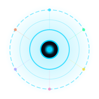

<p align="center">
  
</p>

<h1 align="center">ATLAS</h1>
<p align="center"><strong>Personal Intelligence System</strong></p>
<p align="center">
  Multi-model AI assistant with persistent memory, multi-agent orchestration,<br>
  7 communication channels, 50+ tools, and a neural web interface.
</p>

<p align="center">
  
  
  
  
</p>

---

## What is ATLAS?

ATLAS is a self-hosted, multi-model AI assistant designed as a **personal intelligence system**. It operates across multiple communication channels simultaneously, learns from every interaction through episodic and semantic memory, orchestrates specialized agents for complex tasks, and proactively monitors systems, schedules, and home automation.

Think of it as a **second brain** — always running, always learning, always connected.

---

## Architecture

ATLAS follows a **neuroscience-inspired** modular architecture:

```
┌─────────────────────────────────────────────────────────┐
│                     CHANNELS                            │
│  CLI  Telegram  WhatsApp  Web  Discord  Slack  Dashboard│
└────────────────────┬────────────────────────────────────┘
                     │
┌────────────────────▼────────────────────────────────────┐
│               NEXUS — Coordinator                       │
│  Keyword → Pattern → AI routing │ 4 execution modes     │
│  6 agents: Business, SysAdmin, Developer,               │
│            Researcher, Creative, General                 │
└────────────────────┬────────────────────────────────────┘
                     │
┌────────────────────▼────────────────────────────────────┐
│            CORTEX — Cognitive Loop                       │
│  Perceive → Contextualize → Act → Learn → Reflect       │
│  Session Manager │ Planner │ Reflector │ Context Window  │
└──────┬─────────────────────────────┬────────────────────┘
       │                             │
┌──────▼──────┐            ┌─────────▼──────────┐
│ HIPPOCAMPUS │            │      MOTOR         │
│  Episodic   │            │   50+ Tools        │
│  Semantic   │            │   Tool Registry    │
│  Vector     │            │   Smart Retry      │
│  Knowledge  │            │   Skill Forge      │
│  Graph      │            └────────────────────┘
└─────────────┘
       │
┌──────▼──────────────────────────────────────────────────┐
│               THALAMUS — Model Router                   │
│  Claude │ GPT │ Ollama │ Gemini │ LMStudio │ OpenRouter │
│  Circuit breaker │ Retry │ @prefix routing               │
└─────────────────────────────────────────────────────────┘
       │
┌──────▼──────────────────────────────────────────────────┐
│               SENTINEL — Background Engine              │
│  Scheduler │ Proactive Engine │ Anomaly Detector        │
│  Watchdog │ Pipelines │ Webhooks │ Notifications        │
└─────────────────────────────────────────────────────────┘
```

---

## Features

### Multi-Model Intelligence
- **Anthropic Claude** (native function calling)
- **OpenAI GPT** (with format conversion)
- **Ollama** (local models, retry without tools)
- **Google Gemini**
- **LM Studio** (local)
- **OpenRouter** (any model)
- **llama.cpp** (direct)
- Circuit breaker, exponential backoff, `@model` prefix routing

### 7 Communication Channels
| Channel | Highlights |
|---------|-----------|
| **CLI** | ASCII banner, `/commands`, color output, readline |
| **Telegram** | grammY — text, photos, voice, documents, commands |
| **WhatsApp** | Baileys — QR auth, images, message monitoring |
| **Web** | Neural canvas interface, Socket.IO, PWA |
| **Discord** | discord.js v14 — messages, images, approval buttons |
| **Slack** | Bolt v4 — Socket Mode, threads, slash commands |
| **Dashboard** | React SPA — full admin panel, real-time stats |

### Persistent Memory
- **Episodic** — Full conversation history (SQLite)
- **Semantic** — Facts with confidence scores
- **Vector Store** — Embeddings for semantic search (Ollama/OpenAI)
- **Knowledge Graph** — Entity extraction and relationships
- **Thread Memory** — Detects references to past conversations
- **Correction Learning** — Learns from user corrections

### Multi-Agent Orchestration (Nexus)
6 specialized agents with 3-level routing (keyword → pattern → AI):
- **Business** — Sales, inventory, commercial operations
- **SysAdmin** — Servers, deployment, monitoring
- **Developer** — Code, Laravel, PHP, TypeScript, git
- **Researcher** — Web research, market analysis
- **Creative** — Copywriting, social media, naming
- **General** — Fallback for everything else

4 execution modes: single, parallel, sequential, consensus.

### 50+ Tools
<details>
<summary>Core Tools</summary>

- `shell` — Command execution with approval
- `file_read` / `file_write` / `file_list` — File system operations
- `system_info` — OS and hardware info
- `memory_save` / `memory_recall` — Direct memory access
- `git` — Full git operations (commit/push require approval)
</details>

<details>
<summary>Web & Search</summary>

- `web_search` — DuckDuckGo, Brave, SearXNG
- `web_fetch` — URL content retrieval
</details>

<details>
<summary>Communication</summary>

- `notifications` — Cross-channel messaging
- `whatsapp` — Full WhatsApp control (send, search, stats)
- `twilio` — SMS, WhatsApp, voice calls
- `email` — SMTP email sending
</details>

<details>
<summary>Data & Integration</summary>

- `database_query` — MySQL with SQL safety
- `laravel_api` — REST client for Laravel apps
- `notion` — Notion pages and databases
- `google_sheets` — Spreadsheet operations
- `mqtt` — IoT messaging
- `n8n` — Workflow automation
- `crm` — Built-in contact/deal management
</details>

<details>
<summary>Productivity</summary>

- `schedule_task` — Natural language → cron
- `doc_search` / `doc_manage` — RAG document system
- `templates` — Conversation templates
- `notes` — Personal notes system
- `reminder` — Cross-channel reminders
- `clipboard` — System clipboard access
- `pin` — Pin important messages
- `export_chat` — Export conversations
</details>

<details>
<summary>Media & Generation</summary>

- `voice_tts` — Text-to-speech (OpenAI, ElevenLabs, edge-tts)
- `transcribe` — Audio transcription (Whisper)
- `image_generate` — Image generation (DALL-E, Stable Diffusion)
- `ocr` — Image text extraction
- `qr_generate` — QR code creation
- `summarize_url` — URL summarization
</details>

<details>
<summary>System & DevOps</summary>

- `code_sandbox` — Sandboxed code execution (Docker/local)
- `domotica` — Tuya/Smart Life home automation
- `cloud_backup` — S3/GDrive/local backup
- `copilot` — Background task management
- `spawn_agent` — Sub-agent spawning
- `forge_skill` — AI-driven tool creation
</details>

<details>
<summary>Finance & Utilities</summary>

- `trm_colombia` — Colombian exchange rate
- `weather` — Weather lookup
- `loan_calculator` — Financial calculations
- `financial` — Portfolio tracking
- `converter` — Unit conversion
- `password_gen` — Secure password generation
</details>

### Sentinel (Background Engine)
- **Scheduler** — BullMQ (Redis) or node-cron, natural language scheduling
- **Proactive Engine** — Morning briefings, daily summaries, health checks
- **Anomaly Detector** — System metrics monitoring with AI analysis
- **Watchdog** — Auto-fix rules for common issues
- **Pipeline Engine** — Multi-step automation workflows
- **Webhook Server** — External event ingestion
- **Notification Engine** — Rule-based proactive alerts

### Skill Forge (Self-Evolution)
ATLAS can **create its own tools** from natural language descriptions:
- **Create** — Describe what you need and ATLAS generates a fully functional TypeScript tool
- **Improve** — Give feedback and the tool is refined automatically
- **Auto-Heal** — Failing skills are automatically fixed after repeated errors
- **Auto-Rollback** — Bad versions are reverted if quality drops below threshold
- **Meta-Learner** — Analyzes tool usage patterns and suggests new tools to create
- **Composable Skills** — Generated tools can call other registered tools (chained execution)
- Managed from chat (`forge_skill` tool) or the Dashboard Skills page

### Home Automation
- **Tuya/Smart Life** integration via official API
- Device discovery, state tracking, multi-gang switch support
- Dashboard control panel with real-time state
- Event-driven automation via Pipelines

### Dashboard
- React 18 + Tailwind CSS SPA
- 7+ pages: Overview, Memory, Agents, Skills, Tasks, Logs, Config
- Real-time Socket.IO updates
- JWT authentication
- Domotic device control
- Analytics and cost tracking

---

## Quick Start

### Prerequisites
- **Node.js** >= 22
- **SQLite** (bundled via better-sqlite3)
- At least one AI provider API key (Anthropic recommended)

### Installation

```bash
git clone https://github.com/Dandte/atlas.git
cd atlas
npm install
cp .env.example .env
```

### Configuration

Edit `.env` with your API keys:

```env
# Required — at least one AI provider
ANTHROPIC_API_KEY=sk-ant-...

# Optional — additional providers
OPENAI_API_KEY=sk-...
OLLAMA_BASE_URL=http://localhost:11434

# Optional — channels
TELEGRAM_BOT_TOKEN=...
WHATSAPP_ENABLED=true
WEB_ENABLED=true
WEB_PORT=3001

# Optional — dashboard
DASHBOARD_ENABLED=true
DASHBOARD_PORT=4000
```

See `.env.example` for the full list of 130+ configuration options.

### Run

```bash
# Development
npm run dev

# Production
npm run build && npm start

# With PM2
npm run pm2:start
```

### Web Interfaces

Once running, ATLAS exposes several web interfaces (all configurable via `.env`):

| Service | Default URL | Env Vars | Description |
|---------|------------|----------|-------------|
| **Web Chat** | `http://localhost:3000` | `WEB_ENABLED=true` `WEB_PORT=3000` | Neural interface with animated canvas, real-time chat via Socket.IO, operation/emotion indicators, voice input, PWA installable |
| **Dashboard** | `http://localhost:4000` | `DASHBOARD_ENABLED=true` `DASHBOARD_PORT=4000` | Admin panel (React SPA) — Overview, Memory/Facts CRUD, Agents, Skills, Tasks, Logs, Config, Domotica, Analytics, Costs |
| **Health Server** | `http://localhost:9090` | `HEALTH_SERVER_ENABLED=true` `HEALTH_SERVER_PORT=9090` | Kubernetes/PM2 probes: `/health`, `/ready`, `/live` |
| **Webhook Server** | `http://localhost:5000` | `WEBHOOK_ENABLED=true` `WEBHOOK_PORT=5000` | Incoming webhooks from GitHub, Stripe, Laravel, n8n, etc. |
| **MCP Server** | `http://localhost:5050` | `MCP_SERVER_ENABLED=true` `MCP_SERVER_PORT=5050` | Model Context Protocol server for external AI tool access |

### Dashboard Pages

The dashboard at `http://localhost:4000` includes:

| Page | What it shows |
|------|--------------|
| **Overview** | System stats, uptime, active channels, recent activity, memory counts |
| **Memory** | Browse/search/edit/delete facts, episodes, reflections. Knowledge graph visualization |
| **Agents** | List all agents (built-in + custom), enable/disable, view routing stats |
| **Skills** | Forge-created skills, enable/disable, usage stats, version history |
| **Tasks** | Scheduled tasks (cron), enable/disable, run now, execution history |
| **Logs** | Real-time log viewer with level filtering |
| **Config** | Edit `.env` variables from the browser (restarts not required for most) |
| **Domotica** | Smart home device control — toggle switches, view state, trigger scenes |
| **Analytics** | Tool usage charts, daily activity, hourly distribution, facts over time |
| **Costs** | AI model usage costs per provider, per day, per agent |
| **Pipelines** | Visual pipeline builder and execution history |
| **Channels** | Channel health status, message counts, reconnect controls |

### API Endpoints

The web chat server also exposes REST endpoints:

```
GET  /api/health          — Server health check
GET  /api/stats           — Message counts, uptime, memory stats
POST /api/chat            — Send message (REST alternative to Socket.IO)
GET  /api/emotional       — Current emotional state (for polling)
```

The dashboard exposes a full REST API at `http://localhost:4000/api/`:

```
GET    /api/overview               — System overview
GET    /api/memory/facts           — List facts (with search)
POST   /api/memory/facts           — Create fact
DELETE /api/memory/facts/:id       — Delete fact
GET    /api/episodes               — List episodes
GET    /api/agents                 — List agents
POST   /api/agents/:id/toggle      — Enable/disable agent
GET    /api/skills                 — List skills
POST   /api/skills/:id/toggle      — Enable/disable skill
GET    /api/tasks                  — List scheduled tasks
POST   /api/tasks/:id/toggle       — Enable/disable task
POST   /api/tasks/:id/run          — Run task immediately
GET    /api/tools                  — List registered tools
GET    /api/logs                   — Recent logs
GET    /api/config                 — Current configuration
PUT    /api/config                 — Update configuration
GET    /api/analytics?days=30      — Usage analytics
GET    /api/knowledge-graph        — Knowledge graph nodes/edges
GET    /api/domotica/devices       — Smart home devices
POST   /api/domotica/device/:id/command — Control device
```

---

## Project Structure

```
atlas/
├── src/
│   ├── index.ts              # Entry point & bootstrap
│   ├── types.ts              # Shared TypeScript interfaces
│   ├── bootstrap/            # Initialization modules
│   ├── channels/             # CLI, Telegram, WhatsApp, Web, Discord, Slack
│   ├── config/               # Configuration, soul/personality, emotional engine
│   ├── cortex/               # Cognitive loop, planner, reflector, sessions
│   ├── dashboard/            # Admin dashboard (API + frontend)
│   ├── forge/                # Skill Forge (AI tool creation)
│   ├── hippocampus/          # Memory systems (episodic, semantic, vector, KG)
│   ├── mcp/                  # Model Context Protocol (client + server)
│   ├── motor/                # Tool registry, executor, 50+ tool implementations
│   ├── nexus/                # Multi-agent coordinator + 6 agents
│   ├── rag/                  # Document ingestion & search
│   ├── security/             # Approval system, audit log, DM pairing, permissions
│   ├── sentinel/             # Scheduler, proactive engine, anomaly detector
│   └── utils/                # Logger, backup, health server, graceful shutdown
├── web/                      # Neural web interface (HTML + Canvas + Socket.IO)
├── tests/                    # Jest test suite
├── skills/templates/         # Skill Forge templates
├── docker-compose.yml        # ChromaDB + Redis
├── ecosystem.config.cjs      # PM2 configuration
└── docs/                     # GitHub Pages site
```

---

## Tech Stack

| Layer | Technology |
|-------|-----------|
| Runtime | Node.js 22 |
| Language | TypeScript 5 |
| Database | SQLite (better-sqlite3) |
| AI (Primary) | Anthropic Claude (native function calling) |
| AI (Secondary) | OpenAI, Ollama, Gemini, LMStudio, OpenRouter |
| Web Framework | Express 5 |
| Real-time | Socket.IO 4 |
| Task Queue | BullMQ (Redis) / node-cron |
| Telegram | grammY |
| WhatsApp | Baileys v7 |
| Discord | discord.js v14 |
| Slack | @slack/bolt v4 |
| Home Automation | @tuya/tuya-connector-nodejs |
| Testing | Jest 30 + ts-jest |
| Process Manager | PM2 |

---

## Development

```bash
# Type check
npm run typecheck

# Run tests
npm test

# Watch mode
npm run test:watch

# Coverage
npm run test:coverage
```

---

## License

This project is licensed under the [MIT License](LICENSE).

---

<p align="center">
  <sub>Built with obsessive attention to detail by <strong>Jose</strong>, powered by Claude.</sub>
</p>
